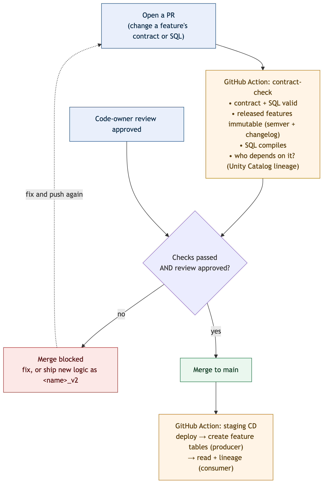

# Feature-sharing demo

A small, self-contained demo of how a team defines a **governed Unity Catalog feature table
as code**, how a change to it is **checked before it can merge**, and how **GitHub Actions
creates the feature table** once the checks pass.



## The idea

A feature table is defined entirely by files in Git. A pull request that changes it runs a
contract check; the change can only merge if every check passes; and once it does, the
pipeline (re)builds the table. Released features are **immutable** — new logic ships as a new
feature (`<name>_v2`), never an in-place edit — so a change can never silently alter what a
model or job already reads.

## Layout

```
feature_sharing_demo/
  features/<table>/              one self-contained folder per feature table
    customer_features.yaml       the contract: schema, meaning, ownership, lifecycle, semver, changelog
    _base.sql                    the query skeleton (grain + source), with a ${features} placeholder
    <feature>.sql                one SQL aggregate expression per feature (e.g. txn_count.sql)
  producer.py                    pipeline: builds EVERY features/<table>/ into a UC feature table
  consumer.py                    reads a feature table and prints its Unity Catalog lineage
  shared/feature_contract_utils.py   the contract rules as plain, unit-tested functions
  governance/
    check_change.py              the PR gate (immutability, semver, SQL compile, downstream impact)
    dependencies.py              what reads a table/column, from Unity Catalog lineage
    notebooks/find_feature_consumers.py   the same lookup, runnable as a job
  tests/                         unit tests for the contract rules
  requirements-ci.txt            pinned deps for the checks
  diagrams/                      the flow diagram (editable .mmd + rendered .png/.svg)
```

Add a feature table by dropping in a **new folder** under `features/` with its own contract
and SQL. The producer builds every folder; nothing else needs to change.

## A feature table, as code

`features/customer_features/customer_features.yaml` is the **contract** — what the table
promises (keys, owner, SLA, and each feature's type, meaning, status and `since` version).
Each feature's **logic** is the SQL file beside it: `_base.sql` is the query skeleton (one
row per customer over the source `transactions`), and each `<feature>.sql` is a single
aggregate expression inserted at `${features}`, for example:

```sql
-- txn_count.sql
count(t.txn_id)
```

`producer.py` substitutes the bundle's `${catalog}` / `${raw_schema}` / `${producer_schema}`,
inserts every expression into `_base.sql`, and writes the table with a
`PRIMARY KEY (customer_id, as_of_date TIMESERIES)` and Change Data Feed — which is what makes
it a feature table consumers can point-in-time join. It also sets discovery comments and tags.

## The checks (what gates a merge)

On every PR that touches the demo, `.github/workflows/feature_sharing_demo-contract-check.yml`
runs `check_change.py` for each changed `features/<table>/`:

1. **Valid?** contract and SQL parse, one SQL file per feature.
2. **What changed?** added / deprecated / changed / removed.
3. **Allowed?** released features are immutable (no in-place SQL or type change); an active
   feature can't be removed; the semver bump and changelog entry must match the change.
4. **Compiles?** the full feature query passes `EXPLAIN`.
5. **Who depends on it?** for anything that would affect existing readers, `dependencies.py`
   reads Unity Catalog lineage (models, jobs, pipelines, dashboards). A change that would
   break a reader is **blocked**; if a dependency can't be read, the PR is blocked too.

Any failing step **stops the run and fails the check**, so nothing is created from an unsafe
change. Merge is allowed only when the check passes and a code owner approves.

## Who creates the features

**GitHub Actions does.** After a PR merges to `main` (or on a manual run of the workflow),
the same workflow — having passed the checks — runs the producer to build the tables:

```
deploy the bundle  →  run feature_producer (build the feature tables)
```

On a pull request the workflow runs the checks only (the gate); the tables are built once the
change is on `main`.

## Jobs (Databricks bundle)

Defined in `resources/feature-sharing-demo-resource.yml`:

| Job | What it does |
|---|---|
| `feature_producer` | Builds every `features/<table>/` as a UC feature table |
| `feature_consumer` | Reads a feature table and shows its lineage |
| `feature_consumers_check` | Reports what depends on a table/column (the same lookup as the PR gate; `fail_if_active=true` makes it the removal gate) |

## Run it locally

```bash
cd databricks_mlops_platform/feature_sharing_demo
pip install -r requirements-ci.txt
pytest tests -q                       # the contract-rule unit tests

cd .. && export DATABRICKS_CONFIG_PROFILE=dbc-aef35066-afa2
databricks bundle deploy -t dev
databricks bundle run feature_producer -t dev     # build the feature table(s)
databricks bundle run feature_consumer -t dev     # read + show lineage
```

Check a contract change locally the way CI does (compare the PR against `main`):

```bash
cd databricks_mlops_platform/feature_sharing_demo
git worktree add /tmp/base origin/main
python governance/check_change.py \
  --base /tmp/base/databricks_mlops_platform/feature_sharing_demo/features/customer_features/customer_features.yaml \
  --proposed features/customer_features/customer_features.yaml \
  --var catalog=workspace --var producer_schema=team_a_features_dev --var raw_schema=feature_demo_raw_dev
```

## Making a change

| Change | How | Version |
|---|---|---|
| New feature | add a `<name>.sql` + a `features:` entry (with `since`) | minor |
| New logic for an existing feature | add `<name>_v2`; deprecate `<name>` (`status`, `sunset_date`, `replaced_by`) | minor |
| Remove a deprecated feature | delete it once nothing reads it | major |
| Definition text, owner, SLA | metadata only | patch |
| Change a released feature's SQL or type in place | **not allowed** — ship `<name>_v2` | — |

Every change needs a changelog entry; SQL comments and whitespace don't count as changes.
