# MLOps Platform — Customer Demo Script

A walkthrough organised as a **user journey**: four people, one model, and the question of
whether it is allowed to reach production.

Structured by persona rather than by feature, because the interesting part of this platform
is not that it trains a model — anyone can do that — but **who is allowed to do what, and
where the system says no.**

- **Total runtime:** ~35 min with narration. The setup phase runs beforehand.
- **Workspace:** `https://dbc-aef35066-afa2.cloud.databricks.com`, catalog `workspace`
- **Repo:** `github.com/anirvandecodes/databricks_mlops_platform`

---

## The one sentence to open and close with

> **No model reaches production without passing an automated quality bar and a named
> human's approval — and any model can be taken out of production in seconds.**

Say it at the start. Prove it in Act 3 and 4. Repeat it at the end. Every other detail
supports that sentence; if you are short on time, cut anything else.

---

## The cast

| Persona | Environment | Deploys how | Can promote to champion? |
|---|---|---|---|
| **Priya** — data scientist | `payments_dev` | `bundle deploy` from her laptop | Yes, instantly — dev serves no one |
| **Sam** — reviewer | `payments_staging` | Merge a PR; CI deploys | Automatic, once CI proves the pipeline |
| **Dana** — release manager | `payments_prod` | Push a `release/*` branch | **No — this is the point** |
| **Ravi** — risk owner | `payments_prod` | Clicks Approve in GitHub | Yes, and only he can |

The punchline of the whole demo: **Priya, who built the model, cannot put it in front of
customers. Ravi, who did not build it, is the only one who can.**

---

## The flow — show this first

Put this on screen before touching a keyboard, and refer back to it at the start of each act
so the audience always knows where they are. It renders on GitHub, so you can share the doc
itself.

```mermaid
flowchart LR
    subgraph DEV["🟢 payments_dev · Priya, data scientist"]
        direction TB
        D1["edit code locally"] --> D2["bundle deploy -t dev"]
        D2 --> D3["train → validate<br/>→ gate → promote"]
        D3 --> D4["@champion moves<br/><i>gate off: serves no one</i>"]
    end
    subgraph STG["🟡 payments_staging · Sam, reviewer"]
        direction TB
        PR["PR checks<br/>83 unit · 25 integration<br/>validate dev/staging/prod"]
        PR --> S1["staging_integration<br/>runs the whole pipeline"]
        S1 --> S2["merge to main"]
        S2 --> S3["Staging CD:<br/>@champion moves<br/>automatically"]
    end
    subgraph PRD["🔴 payments_prod · Dana cuts · Ravi approves"]
        direction TB
        P1["deploy<br/><i>code only, no alias change</i>"]
        P1 --> P2["train → validate<br/>→ stage @challenger"]
        P2 --> GATE{{"⛔ APPROVAL GATE<br/>pipeline STOPS"}}
        GATE -->|"Ravi approves"| P3["write UC tag<br/>approval_status=approved"]
        P3 --> P4["@champion moves<br/>✅ serving traffic"]
        GATE -->|"no approval"| BLOCK["@challenger only<br/>production unchanged"]
        P4 -.->|"incident"| RB["rollback_job<br/><i>ungated, seconds</i>"]
    end
    D4 -.->|"pull request"| PR
    S3 -.->|"push release/*"| P1
    style GATE fill:#ffe0e0,stroke:#c00,stroke-width:3px
    style BLOCK fill:#fff4e0,stroke:#e69500
    style P4 fill:#e0f5e0,stroke:#2a2
    style RB fill:#e8e8f5,stroke:#66c
```



**The three sentences to say over it:**

1. "Left to right is the journey a model takes. Same code the whole way — only configuration changes."
2. "Two of those three environments promote automatically. The third stops and waits for a person."
3. "That red box is the entire point of the platform. Everything else supports it."

---

## What each environment is for

Worth drawing on a whiteboard before you touch a keyboard. It makes every later step obvious.

```
       payments_dev              payments_staging            payments_prod
       ────────────              ────────────────            ─────────────
Who    data scientists           nobody (CI only)            nobody (CD only)
Deploy local laptop              GitHub Actions on merge      GitHub Actions on release/*
Gate   none                      none                        GitHub approval + UC tag
Speed  seconds                   ~7 min                      ~6 min, then waits for a human
Point  iterate freely            prove the pipeline works     prove the model deserves traffic
```

### What to actually click in each environment

Verified against this workspace. Open **Catalog Explorer → `workspace` → `<schema>`** and
show these, in this order.

#### 🟢 `payments_dev` — "a data scientist's working environment"

| Show | What is there | Say |
|---|---|---|
| **Models** | `credit_risk_model` (1 version, `@champion → v1`) | "One version, promoted instantly. No gate here." |
| **Tables (9)** | `credit_features`, `training_data`, `scoring_input`, `raw_model_predictions`, `credit_decisions`, `inference_log`, `baseline_snapshot`, `ground_truth_outcomes`, `promotion_audit_log` | "The full lifecycle exists in dev — features through to decisions. Nothing is special about prod's *shape*." |
| **Functions (2, or 3)** | `evaluate_eligibility`, `calculate_credit_limit` — plus `calculate_psi` once the monitoring job has run | "Business policy is a set of UC functions, not code buried in a notebook. The drift metric joins them when monitoring first runs." |
| **Volumes** | `audit_logs` | "Even dev writes audit evidence." |
| **Jobs** | 5, prefixed `[dev <username>]` | "Per-user namespacing — two scientists cannot collide." |

*The point of dev is that it looks complete and moves fast.*

#### 🟡 `payments_staging` — "the pipeline's proving ground"

| Show | What is there | Say |
|---|---|---|
| **Models** | `credit_risk_model` — **9 versions**, `@champion → v9` | ★ "Nine versions. Every merge to `main` trains and promotes one. This is CI exercising the pipeline over and over." |
| **Tables (9)** | same nine as dev | "Identical schema to dev and prod. One code path." |
| **Functions (2, or 3)** | same as dev | — |
| **Jobs** | 5, prefixed `staging-` | "No user prefix — these are CI's jobs, not a person's." |

*The version count is the story here.* Put dev (1 version) and staging (9 versions) side by
side: staging churns because proving the pipeline is cheap and automatic.

#### 🔴 `payments_prod` — "deliberately sparse"

| Show | What is there | Say |
|---|---|---|
| **Models** | `credit_risk_model` — 2 versions, `@champion → v2` | ★★ "Two versions in production against nine in staging. Getting into production is *rare*, and every one of those two had a named approver." |
| **Tables (3)** | only `training_data`, `baseline_snapshot`, `promotion_audit_log` | ★ "Notice what is **missing** — no `credit_decisions`, no `inference_log`. Production has been deployed and gated, but batch scoring has not been run here. The absence is honest: nothing writes to production until it is asked to." |
| **Functions (1)** | only `credit_risk_model` | "The policy functions land when the decision layer first runs." |
| **Volumes** | `audit_logs` — holds the approval evidence JSON | "This is the auditor's artifact." |
| **Jobs** | 5, prefixed `prod-` | "Same five jobs as everywhere else. Same code." |

*The sparseness is a feature to narrate, not a gap to hide.* If you would rather prod look
fully populated, run `databricks bundle run batch_inference_job -t prod` during setup — but
the contrast is more interesting than the completeness.

#### The comparison slide

Put all three Models tabs side by side. This one table makes the governance argument
without a word of explanation:

| | dev | staging | prod |
|---|---|---|---|
| Model versions | 1 | **9** | **2** |
| Tables | 9 | 9 | 3 |
| UC functions | 2 | 2 | 1 |
| Who promoted | Priya, instantly | CI, automatically | **Ravi, deliberately** |

> "Nine models proved the pipeline. Two reached customers. That ratio is what governance
> looks like when it is enforced rather than documented."

---

All three are **schemas in one catalog** (`workspace`), separated by grants. One code path,
three targets, and the only differences are variables in `databricks.yml`:

```yaml
targets:
  dev:      { variables: { schema_name: payments_dev,     approval_required: "false" } }
  staging:  { variables: { schema_name: payments_staging, approval_required: "false" } }
  prod:     { variables: { schema_name: payments_prod,    approval_required: "true"  } }
```

> "The artifact promoted to production is the same code that passed staging. There is no
> separate production branch of the pipeline, and no environment-specific `if` statements —
> the difference is configuration, and configuration is reviewed in a pull request."

---

## Before the demo — setup checklist

Run these **before the audience joins.** Nothing here is worth watching.

### 1. Confirm the three schemas exist

```bash
cd databricks_mlops_platform
python scripts/bootstrap_uc.py --profile real-anirvan --catalog workspace --prefix payments
```

Idempotent. Creates `payments_dev` / `payments_staging` / `payments_prod` plus the audit
Volume if missing, then verifies each is writable.

Needs `CREATE SCHEMA` on the catalog — use an account that is in the workspace `admins`
group. If it reports `PERMISSION_DENIED`, you are authenticated as the wrong user.

### 2. Prime dev so the workspace looks alive

```bash
databricks bundle deploy -t dev
databricks bundle run write_feature_table_job -t dev    # ~2 min
databricks bundle run model_training_job -t dev         # ~4 min
databricks bundle run batch_inference_job -t dev        # ~3 min
databricks bundle run monitoring_job -t dev             # ~3 min, only if demoing Act 7
```

An empty workspace is a bad opening. After this you have a champion, a scored batch,
decisions and an audit trail.

The monitoring run is what creates `drift_check_results`, so skip it only if you are also
skipping Act 7.

If you are demoing Act 7h (the managed monitor), give its first refresh a few minutes and then
confirm both of these before you present — details and fallbacks in 7h:

```bash
databricks quality-monitors get workspace.payments_dev.inference_log \
  --profile real-anirvan | grep '"status"'          # want MONITOR_STATUS_ACTIVE
```

```sql
SELECT count(*) FROM workspace.payments_dev.inference_log_profile_metrics;  -- want > 0
```

### 3. Check the production gate is armed

**GitHub → Settings → Environments → production:**

| Setting | Must be |
|---|---|
| Required reviewers | your account, added |
| Prevent self-review | **unticked** — otherwise you cannot approve your own demo |
| Wait timer | **unticked** — 15 minutes of dead air otherwise |
| Deployment branches | `release/*` |
| Allow administrators to bypass | **untick before demoing** — see the honesty note below |

Verify from the terminal rather than trusting the UI:

```bash
gh api repos/anirvandecodes/databricks_mlops_platform/environments/production \
  --jq '.protection_rules'
```

You want to see `required_reviewers` in that list.

### 4. Decide your starting point for prod

Check what production is currently serving:

```bash
databricks api get \
  "/api/2.1/unity-catalog/models/workspace.payments_prod.credit_risk_model?include_aliases=true" \
  --profile real-anirvan | python3 -c \
  "import sys,json; print([(a['alias_name'],'v'+str(a['version_num'])) for a in json.load(sys.stdin).get('aliases',[])])"
```

If it already shows a `champion`, you have two honest options:

- **Narrate it as a routine release** — "production is serving v2; we are shipping a
  replacement." This is more realistic and needs no cleanup.
- **Show a first deployment** — delete the `champion` alias so the gate demo starts from
  nothing. The blocked message then reads *"production serves no champion yet (first
  deployment)"*.

Prefer the first. Real systems are never empty.

### 5. Tabs to have open

1. **GitHub → Actions** — the run list
2. **GitHub → the open PR** (for Act 2)
3. **Databricks → Catalog Explorer** → `workspace` → `payments_prod` → Models →
   `credit_risk_model` → **Versions** ← *this tab is the centrepiece; the alias column is
   where the story lands*
4. **Databricks → Jobs & Pipelines**
5. **SQL Editor** with the Act 5 queries pasted
6. Editor open on `databricks_mlops_platform/validation/validation.py`
7. For Act 7: **Catalog Explorer → `payments_dev` → `inference_log` → Quality** tab, and the
   generated `inference_log Monitoring` dashboard opened from it — loading that dashboard cold
   in front of an audience is slow

---

# Act 1 — Priya works in dev (6 min)

**Persona:** data scientist. **Message:** *fast, unceremonious, because dev serves nobody.*

### 1a. Show that the environments are code

Open `databricks_mlops_platform/databricks.yml`. Point at the `targets:` block from the
table above.

> "Three environments, one file. When Priya wants a new environment she adds six lines and
> opens a pull request — she does not file a ticket with a platform team."

### 1b. Change something a data scientist would actually change

Open `validation/validation.py` and show the quality thresholds — the automated bar a model
must clear before any human is even asked.

> "These are the numbers a risk team argues about. They are in version control, so changing
> the bar is a reviewed pull request, not a conversation someone half-remembers."

### 1c. Deploy from the laptop

```bash
databricks bundle deploy -t dev
```

```
Uploading bundle files to /Workspace/Users/.../.bundle/databricks_mlops_platform/dev/files...
Deploying resources...
Deployment complete!
```

Show **Jobs & Pipelines** — five jobs prefixed `[dev <username>]`.

> "The prefix matters: development mode namespaces every asset per user, so two data
> scientists deploying at once cannot collide. Same code, isolated workspaces."

### 1d. Train, and watch dev promote immediately

```bash
databricks bundle run model_training_job -t dev
```

Open the run and show the four tasks:

```
Train           → SUCCESS
ModelValidation → SUCCESS
ApprovalGate    → SUCCESS   ← passes automatically here
ModelDeployment → SUCCESS
```

Then the Models tab: `champion` has moved to the new version.

> "In dev the gate is configured off, so Priya iterates at full speed. That is deliberate:
> a gate that slows down experimentation gets worked around. Nothing in dev serves a
> customer, so there is nothing to protect."

**Contrast to plant now, because it pays off in Act 3:** *"Remember that ApprovalGate task
succeeded. Watch what the identical task does in production."*

---

# Act 2 — Sam reviews the code, staging proves the pipeline (7 min)

**Persona:** reviewer. **Message:** *this is the CODE gate. It says nothing about the model.*

### 2a. Open the pull request

Show the checks running on any PR:

| Check | What it proves |
|---|---|
| `lint` | Workflow YAML and shell are valid |
| `unit_tests` | 83 tests — transforms, PSI maths, gate logic, policy rules |
| `integration_tests` | 25 tests against real Unity Catalog |
| `validate (dev/staging/prod)` | The bundle resolves for **all three** targets |
| `staging_integration` | Deploys to staging and runs the entire pipeline end to end |

> "Notice prod is validated on every pull request. A bad production variable is caught while
> the change is still reviewable, not at release time."

### 2b. The check that earns its keep

Point specifically at `staging_integration`.

> "This deploys to staging and runs feature engineering, training, validation, the gate and
> batch inference — about seven minutes. It is expensive, and it has caught every defect
> that mattered while this platform was built: an MLflow API rename, a schema mismatch
> between the baseline and inference tables, an SDK argument that is valid on create but
> rejected on update. None were visible to unit tests."

**A real example, if you want one** (it is a good story because it is unflattering):

> "During development, 83 unit tests passed while Unity Catalog rejected every single model
> registration — the test fixture logged models without a signature, which UC requires. Only
> the integration tier caught it."

### 2c. Merge, and staging promotes itself

Merge the PR. Show **Actions** → *Staging CD* firing on `main`:

```
Deploy bundle to staging    → Deployment complete!
Refresh features            → FEATURES_WRITTEN
Train, validate and promote → TERMINATED SUCCESS
Score and decide            → SCORED:199  DECISIONS:199
```

Show staging's Models tab — `champion` has moved.

> "Staging runs the whole chain unattended, including promotion. The point of staging is to
> prove the *pipeline* works. Production exists to decide whether the *model* deserves
> traffic. Two different questions, two different gates."

---

# Act 3 — Dana cuts a release, and the system says no (7 min) ★★★

**Persona:** release manager. **Message:** *this is the moment the platform earns its
description.*

### 3a. Cut the release branch

```bash
git checkout main && git pull
git checkout -b release/2026-08-demo
git push -u origin release/2026-08-demo
```

> "Each release is its own branch, so the branch name records which release a given
> promotion belonged to. Production CD triggers on `release/**` and nothing else."

### 3b. Narrate while it runs (~6 min)

Show **Actions** → *Prod CD*. Three jobs:

```
deploy                    ✅  pushes code + job definitions — changes no alias
train_and_stage_candidate ✅  trains, validates, stages @challenger
promote                   ⏸  WAITING FOR APPROVAL
```

Talk through why `deploy` is safe while the first two run:

> "Deploying to production is not the same as changing what production serves. The deploy
> step updates code and job definitions; the model alias is untouched, so production keeps
> serving whatever it was serving. Those are separate operations on purpose."

### 3c. The moment — GitHub stops

The `promote` job shows:

```
Waiting for review: production needs approval to start deploying changes.
Review pending deployments
```

> "The pipeline has trained a model, validated it against the thresholds, and staged it as
> a challenger. And then it stopped. Dana cut this release. Dana cannot complete it."

### 3d. Prove it in Unity Catalog ← do not skip this

Switch to the **Catalog Explorer** tab. Refresh.

```
Version 3   validation_f1_...  +4   @challenger
Version 2   validation_f1_...  +4   @champion
```

Point at the alias column and pause.

> "The new version exists. It passed validation. It carries `@challenger`. It does **not**
> carry `@champion`. Production is still serving version 2, and every scoring job resolves
> `models:/credit_risk_model@champion` at run time — so not one prediction has changed."

**This is the single most important screen in the demo.** Let it sit.

### 3e. Show the gate is a technical control, not a convention

Open the `train_and_stage_candidate` job log and find the `ApprovalGate` task failure:

```
======================================================================
PROMOTION BLOCKED — approval required in environment 'prod'.
======================================================================
Model  : workspace.payments_prod.credit_risk_model
Version: 3
No 'approval_status' tag on version 3. A reviewer must set
approval_status=approved on the model version to authorise promotion.
======================================================================
```

> "That is the job failing — deliberately. Remember the ApprovalGate task that succeeded in
> dev? Identical code, identical task, one variable different: `approval_required=true`. The
> gate is not documentation or a checklist. It is a pipeline that stops."

**If someone asks about the red X:** the Databricks job genuinely failed; the workflow
expects that and reports "Candidate awaiting approval" instead of a failure. The block is
the feature.

---

# Act 4 — Ravi approves, with the evidence in front of him (6 min) ★★

**Persona:** risk owner. **Message:** *an informed decision by a named human, recorded as a
governed object.*

### 4a. Show what the reviewer sees

On the paused run, the candidate's metrics are surfaced with the approval request:

```
status PASSED | f1 score 0.6720 | precision score 0.5615 | recall score 0.8367 | roc auc 0.8712
```

> "Ravi is not asked to approve 'the deployment'. He is asked to approve *this version*, and
> he can see how it performed before he decides. An approval request without the numbers is
> a rubber stamp."

### 4b. Approve

Click **Review deployments** → tick `production` → **Approve and deploy**.

### 4c. Show what the approval became

The `promote` job runs three steps:

```
Record the reviewer's approval in Unity Catalog  ✅
Promote the approved version to champion         ✅
Summarise                                        ✅
```

Back in **Catalog Explorer**, refresh and open the version's **Tags**:

```
approval_status = approved
approved_by     = anirvandecodes        ← the GitHub user who clicked
validation_status = PASSED
validation_roc_auc = 0.8712
```

And the alias column now reads `@champion`.

> "The approval is a Unity Catalog tag — a governed object. It is versioned, permissioned
> and visible in lineage. It is not a Slack message, a ticket comment, or a spreadsheet
> someone maintains. An auditor asking 'who approved the model that made this decision' has
> a queryable answer."

### 4d. The design point worth stating explicitly

> "The GitHub click and the Unity Catalog tag are **one decision recorded in two places**,
> not two separate reviews. Approving writes the tag; the in-pipeline gate re-reads it before
> moving any alias. So there is exactly one place that decides whether a version may serve
> traffic, and it is enforced even if someone bypasses GitHub entirely and runs the job by
> hand."

---

# Act 5 — The audit trail (5 min)

**Message:** *every promotion is evidence, produced automatically.*

### 5a. Query the promotion log

```sql
SELECT environment, promoted_version, approver, decision, git_commit
FROM workspace.payments_prod.promotion_audit_log
ORDER BY recorded_at DESC
LIMIT 5;
```

Real output from this workspace:

```
prod | 2 | anirvandecodes | APPROVED_AND_PROMOTED |
url:https://github.com/anirvandecodes/databricks_mlops_platform;
branch:release; commit:eb2e6162d7cf81a21db2906a34f161e365b249f2
```

> "Environment, version, approver, decision, and the exact commit. From a production
> prediction you can reach the model version, the approver, the training data version, and
> the line of code — without asking anyone to remember anything."

### 5b. The immutable evidence package

```sql
LIST '/Volumes/workspace/payments_prod/audit_logs';
```

```
approval_workspace_payments_prod_credit_risk_model_v2_2026-08-03T18-01-39.259656+00-00.json
```

> "The Delta table is the queryable index; the Volume holds the full JSON evidence package.
> Volumes are append-only governed storage, so the evidence cannot be quietly edited later."

### 5c. Full column list, if asked

`timestamp`, `model_name`, `promoted_version`, `environment`, `approver`, `decision`,
`evaluation_summary`, `training_data_version`, `git_commit`, `mlflow_run_id`,
`evidence_path`, `recorded_at`.

---

# Act 6 — Rollback: the gate must never prolong an incident (4 min)

**Persona:** on-call engineer at 2am. **Message:** *controls are asymmetric on purpose.*

```bash
databricks bundle run rollback_job -t prod
```

Champion reverts to the previous version in seconds. Show the alias moving back.

> "Rollback is deliberately **not** gated on approval. Requiring sign-off to *stop* serving
> a bad model would extend the incident. The gate exists to control what goes live, not to
> obstruct taking something down."

> "And it is one alias write — no redeploy, no retraining. That is the payoff of alias-based
> promotion: recovery is a metadata operation, so it takes seconds and cannot fail halfway."

Note it is still fully audited: the rollback writes its own audit row.

**Target a specific version if asked:**

```bash
databricks bundle run rollback_job -t prod --params target_version=1
```

---

# Act 7 — Drift monitoring and gated retraining (8 min, + 3 for 7h)

**Message:** *automation notices drift and responds to it — but automation never promotes.*

This is the act that answers "what happens six months after go-live?", so do not skip it if
the audience includes anyone who will own the model in production.

### 7a. Show the monitoring workflow's shape first

Open **Jobs & Pipelines → `dev-mlops-platform-monitoring-job`** and show the task graph.
Four tasks, and the branch is the interesting part:

```
SetupMonitor  →  DriftCheck  →  IsRetrainRequired  ──true──→  TriggerRetraining
                                        │                     (runs model_training_job)
                                        └──false──→  (ends, no action)
```

> "A condition task branches on the drift verdict. If nothing has drifted the workflow ends
> quietly. If something has, it triggers the *training* job — and you have already seen where
> that ends up in production."

Point out the schedule: `0 0 18 * * ?` — daily at 18:00 UTC, after the day's scoring.

> "It is deployed paused, so a demo workspace does not accumulate runs. In production you
> unpause it and drift is checked every evening without anyone remembering to."

### 7b. The PSI metric, and why it is a Unity Catalog function

Open `platform_utils/metrics.py` and show `population_stability_index`.

PSI = Σ (aᵢ − eᵢ) × ln(aᵢ / eᵢ) over distribution buckets, with the conventional
credit-risk reading:

| PSI | Meaning | Platform action |
|---|---|---|
| < 0.10 | no significant population shift | `STABLE` — nothing happens |
| 0.10 – 0.25 | moderate shift, investigate | `WARN` — recorded, no retraining |
| ≥ 0.25 | significant shift | `RETRAIN` — triggers the training job |

`SetupMonitor` registers this as a **UC SQL function** named `calculate_psi`. It does **not
exist until the monitoring job has run** — that job is what creates it — so run the job during
setup, then show the function in Catalog Explorer under Functions.

> "PSI is registered in Unity Catalog rather than shipped in a wheel per job. That means
> every team — data science, model risk, audit — computes drift with the identical audited
> formula. It is also callable from a SQL dashboard by someone who has never opened the repo."

And the guard that makes it trustworthy:

> "An integration test asserts the SQL function returns the same value as the Python
> reference implementation. A silently divergent metric would make the whole drift story
> untrustworthy, so the platform tests that they agree."

Once the monitoring job has run at least once, call the function live in the SQL editor:

```sql
SELECT workspace.payments_dev.calculate_psi(
  array(400D, 50D, 25D, 25D),      -- live distribution, heavily shifted
  array(100D, 100D, 100D, 100D)    -- training baseline, uniform
) AS psi;
```

Returns a value well above 0.25 — a clear retrain signal. `SetupMonitor` runs this exact
sanity check itself and asserts the result exceeds 0.25, so a broken metric fails the job
rather than silently reporting no drift.

**If it errors with `UNRESOLVED_ROUTINE`,** the monitoring job has not run in that schema yet.
That is the expected state on a fresh workspace, not a fault.

### 7c. The thresholds are configuration, not code

Show them in `databricks.yml`:

```yaml
psi_warn_threshold:    { default: "0.10" }
psi_retrain_threshold: { default: "0.25" }
```

> "The thresholds are bundle variables, so a risk owner tunes them per environment through a
> reviewed pull request. Nobody edits a notebook to change when the platform retrains."

### 7d. What is actually monitored

Six features, from `MONITORED_FEATURE_COLUMNS`:

`duration` · `credit_amount` · `age` · `installment_commitment` ·
`monthly_instalment` · `credit_to_age_ratio`

> "Not every column — the ones whose distribution shifting would actually invalidate the
> model, including the two engineered features. Both distributions are bucketed on edges
> derived from the *baseline*, which matters: comparing distributions bucketed on different
> edges is the most common way a hand-rolled PSI silently goes wrong."

### 7e. Run it and read the output

```bash
databricks bundle run monitoring_job -t dev
```

The `DriftCheck` task output is written to be read aloud:

```
baseline rows=1000, live rows=199
PSI thresholds: warn >= 0.1, retrain >= 0.25
  duration                     PSI=0.0142  STABLE
  credit_amount                PSI=0.0231  STABLE
  age                          PSI=0.0088  STABLE
  installment_commitment       PSI=0.0195  STABLE
  monthly_instalment           PSI=0.0176  STABLE
  credit_to_age_ratio          PSI=0.0203  STABLE
==================================================================
Features checked : 6
Warnings         : 0 []
Retrain breaches : 0 []
Worst drift      : credit_amount (PSI=0.0231)
Decision         : NO ACTION
==================================================================
```

(Exact PSI values vary by run; on a freshly scored batch they are all low, because the live
data and the baseline come from the same population.)

Then the persisted results:

```sql
SELECT feature, psi, verdict, checked_at
FROM workspace.payments_dev.drift_check_results
ORDER BY checked_at DESC, psi DESC;
```

> "Every check is a row, so drift is a time series you can chart and a regulator can query —
> not a log line that scrolls away."

### 7f. Force a breach — the demo that actually lands ★

Describing a threshold is weak; showing the pipeline react is strong. Inject skewed rows into
the inference log so PSI crosses 0.25:

```sql
-- Skew the live population hard: triple the credit amounts and ages.
-- Columns are listed explicitly — Databricks SQL does not support SELECT * REPLACE (...).
INSERT INTO workspace.payments_dev.inference_log
SELECT
  concat(customer_id, '_drift') AS customer_id,
  duration,
  credit_amount * 3             AS credit_amount,
  age * 3                       AS age,
  installment_commitment,
  monthly_instalment,
  credit_to_age_ratio,
  prediction,
  model_version,
  scored_at,
  ground_truth
FROM workspace.payments_dev.inference_log
LIMIT 150;
```

Re-run the monitoring job:

```bash
databricks bundle run monitoring_job -t dev
```

Now the output flips:

```
  credit_amount                PSI=0.3187  RETRAIN
  age                          PSI=0.2941  RETRAIN
Decision         : RETRAIN

Triggering retraining. The retrained model will register as a CHALLENGER and
must still pass validation and the approval gate before it can serve traffic.
```

Show the workflow graph: `IsRetrainRequired` took the **true** branch and
`TriggerRetraining` fired the training job.

**Clean up afterwards:**

```sql
TRUNCATE TABLE workspace.payments_dev.inference_log;
```

Then re-run `batch_inference_job -t dev` to repopulate it with honest data.

### 7g. The governance point — do not rush this

> "Drift triggered *retraining*, not *promotion*. The retrained model registered as a
> challenger. To reach production it must clear validation and then the same approval gate
> Ravi used — a named human looking at metrics."

> "That is the distinction that matters in a regulated setting. Plenty of platforms will
> automatically retrain and redeploy on drift. This one automates the *response* to drift and
> keeps the *decision* with a person. Automated drift response is never an unreviewed path
> into production."

### 7h. The managed layer — data profiling

`SetupMonitor` also attaches a **data profiling monitor** with an **Inference profile** to the
inference log table. (Data profiling is the current name for what was called Lakehouse
Monitoring; the SDK namespace is still `w.quality_monitors`, and Databricks groups it under
"data quality monitoring" alongside anomaly detection.)

**How to demo this — three beats, about 3 minutes.**

**Beat 1 — the monitor exists and is managed, not hand-built.** Start in the UI, because the
point is that nobody wrote this: **Catalog Explorer → `workspace.payments_dev.inference_log`
→ Quality** tab. It shows the monitor's status, its refresh history, and a link to a generated
dashboard.

> "I did not build this tab, and I did not write a line of SQL for it. The pipeline attached a
> monitor to the inference table, and Databricks profiles every column, computes drift against
> the training baseline, and generates a dashboard from that."

If someone asks whether it is really deployed rather than clicked together by hand, show it
from the CLI — this is also your pre-demo health check:

```bash
databricks quality-monitors get \
  workspace.payments_dev.inference_log \
  --profile real-anirvan
```

Read out three fields from the response: `"status": "MONITOR_STATUS_ACTIVE"`,
`"baseline_table_name"` pointing at `baseline_snapshot`, and the `inference_log` block showing
`problem_type`, `prediction_col`, `label_col` and `timestamp_col`.

> "It knows this is a classification model, which column is the prediction, which is the
> label, and which is the timestamp. That is what makes it a *model* monitor rather than a
> generic table profiler."

**Beat 2 — open the generated dashboard.** From the Quality tab, click through to the
dashboard (`inference_log Monitoring`, under `/Shared/monitoring/payments_dev/...`). This is
the strongest single visual in the act — a dashboard the team gets for free.

> "Six months after go-live, this is the page the model owner opens on a Monday morning. It
> came with the pipeline."

**Beat 3 — show the metric table underneath, for the technical audience.** The dashboard is
backed by a plain Unity Catalog table, which is the part an engineer or an auditor cares
about:

```sql
SELECT column_name, log_type, count, num_nulls, round(avg, 2) AS mean
FROM workspace.payments_dev.inference_log_profile_metrics
WHERE slice_key IS NULL
  AND (log_type = 'BASELINE' OR model_version = '*')
  AND column_name IN ('credit_amount', 'age')
ORDER BY column_name, log_type;
```

Verified output on this workspace:

```
age            BASELINE  800  0    35.32
age            INPUT     199  0    36.70
credit_amount  BASELINE  800  0  3189.59
credit_amount  INPUT     199  0  3154.38
```

> "`BASELINE` is the training distribution, `INPUT` is what production actually scored. Same
> table, side by side, queryable by anyone with SELECT. Nothing here is locked inside a
> monitoring product."

Two filters in that query are worth knowing so a stray row does not confuse you on screen:
`slice_key IS NULL` takes the whole-population rows rather than the per-slice breakdowns, and
`model_version = '*'` takes the all-versions rollup — without it each live window appears
twice, once per version and once for `*`.

> "So there are two layers of monitoring, and they answer different questions. Data profiling
> is the managed layer: it profiles every column, computes drift against the baseline, and
> generates a dashboard without anyone writing SQL. The custom PSI layer is the *governed*
> one: a single audited formula in Unity Catalog with an explicit, thresholded retraining
> branch that a risk owner tunes by pull request."

#### Check these before you present

Two states will embarrass you live. Both are expected on a freshly seeded schema, and both
have a clean way to handle them on screen.

**1. Metric tables not materialised yet.** The tables are declared when the monitor is
created but only filled by its first refresh — several minutes, sometimes longer on a small
serverless warehouse. Querying too early returns `TABLE_OR_VIEW_NOT_FOUND`.

```bash
databricks quality-monitors list-refreshes \
  workspace.payments_dev.inference_log --profile real-anirvan
```

Wait for a refresh with `"state": "SUCCESS"`. To force one rather than wait for the schedule:
`databricks quality-monitors run-refresh <table>`. If it still is not ready, skip Beat 3 and
stay on the Quality tab and `drift_check_results` — the governance story does not depend on
the managed tables.

(The CLI prints a deprecation notice pointing at a newer `/api/data-quality/v1/monitors` API.
That endpoint is **not served on this workspace yet** — it answers "No API found" — so the
`quality-monitors` commands above remain the ones to use here. Worth knowing if an audience
member notices the notice.)

**2. The drift metrics table is empty — expect this, and say so.** `inference_log_drift_metrics`
has 0 rows on a fresh schema even though the monitor is healthy. Drift compares consecutive
windows, and a single scoring run writes one `scored_at` value, so there is one `1 day` window
and nothing to diff. Separately, if `ground_truth` is still NULL in the inference log, no
label-dependent metric can compute.

Do not open that table cold and improvise. Either avoid it, or use it as the honest point it
actually is:

> "Drift on the managed layer needs two time windows to compare, and this schema has been
> scored once. In production it fills in overnight. That is exactly why the custom PSI layer
> exists — it compares live against the training baseline, so it gives a verdict on day one
> rather than on day two."

To make it populate for a demo that needs it: score a second batch on a later day (or backdate
`scored_at` across two days), join in `ground_truth_outcomes` to supply labels — it already
holds 1000 rows in dev — then refresh the monitor.

**Why the code tolerates the feature being absent:** `SetupMonitor` catches the
endpoint-absent response and exits `MONITOR_UNSUPPORTED` rather than failing, because a
capability gap in a workspace is not a fault in the pipeline. Permission and configuration
errors still raise, so this cannot hide a real misconfiguration. On this workspace the path
is not exercised — the monitor is created successfully.

---

# Closing (2 min)

Return to the opening sentence and show it was earned:

| Claim | Where you proved it |
|---|---|
| Automated quality bar | Act 2 — validation thresholds in code, tested |
| Named human's approval | Act 4 — `approved_by` tag, `@champion` moved only after the click |
| Cannot be bypassed | Act 3 — the pipeline failed rather than promoted |
| Removed in seconds | Act 6 — one alias write, ungated |
| Auditable | Act 5 — approver + commit + data version, queryable |

Then the persona point:

> "Priya built the model and cannot ship it. Dana can cut a release and cannot complete it.
> Ravi did not build the model and is the only person who can put it in front of customers.
> That separation is enforced by the platform, not by policy."

---

## Known gaps — say these before you are asked

Volunteering limitations builds far more credibility than being caught by them.

**The monitoring jobs are deployed paused and are not run by CI/CD.** The monitoring job's
schedule (`0 0 18 * * ?`) ships with `pause_status: PAUSED`, and no CD workflow invokes it —
so on a fresh deployment it has never run, and neither `calculate_psi` nor
`drift_check_results` exists yet. Run it once during setup. In production you unpause the
schedule; that is a deliberate deployment decision rather than something CI should force.

**Separation of duties is demonstrated, not enforced, in this instance.** The repo has a
single owner, so the same person plays every persona. The *mechanism* is real — the pipeline
genuinely cannot promote without an approval, and the approver's identity is recorded. But in
a real deployment the required reviewer would be a risk-owner team that excludes the model
authors. Say this plainly; do not imply this instance proves independent review.

**Admin bypass.** If "Allow administrators to bypass configured protection rules" is left
ticked on the production environment, a repo admin can skip the approval gate. Untick it
before demoing, or state that it is on.

**Not built:** distributed hyperparameter tuning, real-time serving and the online feature
store, FinOps tagging and budgets. Approval is a GitHub review plus a UC tag rather than a
developer-portal integration — the control is enforced; the portal is not built.

---

## If the demo breaks

| Symptom | Cause | Fix |
|---|---|---|
| `PERMISSION_DENIED` on schema or catalog | authenticated as a non-admin account | use an account in the workspace `admins` group |
| Prod CD does not trigger | branch is not `release/*`, or the environment's deployment-branch rule does not match | check the rule is `release/*`, not the literal `release` |
| `promote` runs without pausing | required reviewers not configured | Settings → Environments → production → Required reviewers |
| Approval button greyed out | "Prevent self-review" is ticked | untick it, or approve from a second account |
| Long pause before the approval prompt | wait timer is set | untick Wait timer |
| `ApprovalGate` fails in dev or staging | `approval_required` accidentally `"true"` | check the target's variables in `databricks.yml` |
| SQL query returns `PENDING` forever | serverless warehouse is cold | re-run; first query after idle takes ~30s |
| Job fails on `mlflow` import | notebook `%pip install` step was skipped | re-run the job from the top, not a single task |
| `Not Found` checking the monitor over REST | the `/api/2.0/lakehouse-monitoring/...` path is retired | use `databricks quality-monitors get <table>`, or REST `/api/2.1/unity-catalog/tables/<table>/monitor` |
| `TABLE_OR_VIEW_NOT_FOUND` on a `*_profile_metrics` table | monitor's first refresh has not finished | `databricks quality-monitors list-refreshes <table>`; wait for `SUCCESS` or force one with `run-refresh` |
| `inference_log_drift_metrics` is empty | only one scoring window exists, so there is nothing to compare | expected on a fresh schema — see 7h and narrate it rather than hiding it |

**Recovering mid-demo:** the state that matters is the `@champion` alias. If a run leaves
production in an odd state, `databricks bundle run rollback_job -t prod` restores the previous
champion in seconds — and doing that in front of the audience is itself a good demo of Act 6.
