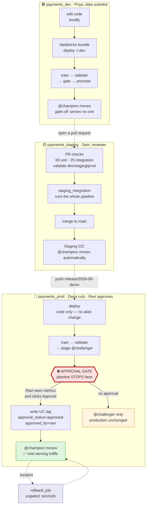

# MLOps Platform — Customer Demo Script

A walkthrough organised as a **user journey**: four people, one model, and the question of
whether it is allowed to reach production.

Structured by persona rather than by feature, because the interesting part of this platform
is not that it trains a model — anyone can do that — but **who is allowed to do what, and
where the system says no.**

- **Total runtime:** ~35 min with narration. The setup phase runs beforehand.
- **Workspace:** `https://dbc-aef35066-afa2.cloud.databricks.com`, catalog `workspace`
- **Repo:** `github.com/anirvandecodes/databricks_mlops_platform`

---

## The one sentence to open and close with

> **No model reaches production without passing an automated quality bar and a named
> human's approval — and any model can be taken out of production in seconds.**

Say it at the start. Prove it in Act 3 and 4. Repeat it at the end. Every other detail
supports that sentence; if you are short on time, cut anything else.

---

## The cast

| Persona | Environment | Deploys how | Can promote to champion? |
|---|---|---|---|
| **Priya** — data scientist | `payments_dev` | `bundle deploy` from her laptop | Yes, instantly — dev serves no one |
| **Sam** — reviewer | `payments_staging` | Merge a PR; CI deploys | Automatic, once CI proves the pipeline |
| **Dana** — release manager | `payments_prod` | Push a `release/*` branch | **No — this is the point** |
| **Ravi** — risk owner | `payments_prod` | Clicks Approve in GitHub | Yes, and only he can |

The punchline of the whole demo: **Priya, who built the model, cannot put it in front of
customers. Ravi, who did not build it, is the only one who can.**

---

## The flow — show this first

Put this on screen before touching a keyboard, and refer back to it at the start of each act
so the audience always knows where they are. It renders on GitHub, so you can share the doc
itself.



**The three sentences to say over it:**

1. "Left to right is the journey a model takes. Same code the whole way — only configuration changes."
2. "Two of those three environments promote automatically. The third stops and waits for a person."
3. "That red box is the entire point of the platform. Everything else supports it."

---

## What each environment is for

Worth drawing on a whiteboard before you touch a keyboard. It makes every later step obvious.

```
       payments_dev              payments_staging            payments_prod
       ────────────              ────────────────            ─────────────
Who    data scientists           nobody (CI only)            nobody (CD only)
Deploy local laptop              GitHub Actions on merge      GitHub Actions on release/*
Gate   none                      none                        GitHub approval + UC tag
Speed  seconds                   ~7 min                      ~6 min, then waits for a human
Point  iterate freely            prove the pipeline works     prove the model deserves traffic
```

### What to actually click in each environment

Verified against this workspace. Open **Catalog Explorer → `workspace` → `<schema>`** and
show these, in this order.

#### 🟢 `payments_dev` — "a data scientist's working environment"

| Show | What is there | Say |
|---|---|---|
| **Models** | `credit_risk_model` (1 version, `@champion → v1`) | "One version, promoted instantly. No gate here." |
| **Tables (9)** | `credit_features`, `training_data`, `scoring_input`, `raw_model_predictions`, `credit_decisions`, `inference_log`, `baseline_snapshot`, `ground_truth_outcomes`, `promotion_audit_log` | "The full lifecycle exists in dev — features through to decisions. Nothing is special about prod's *shape*." |
| **Functions (3)** | `evaluate_eligibility`, `calculate_credit_limit`, `calculate_psi` | "Business policy and the drift metric are UC functions, not code buried in a notebook." |
| **Volumes** | `audit_logs` | "Even dev writes audit evidence." |
| **Jobs** | 5, prefixed `[dev <username>]` | "Per-user namespacing — two scientists cannot collide." |

*The point of dev is that it looks complete and moves fast.*

#### 🟡 `payments_staging` — "the pipeline's proving ground"

| Show | What is there | Say |
|---|---|---|
| **Models** | `credit_risk_model` — **9 versions**, `@champion → v9` | ★ "Nine versions. Every merge to `main` trains and promotes one. This is CI exercising the pipeline over and over." |
| **Tables (9)** | same nine as dev | "Identical schema to dev and prod. One code path." |
| **Functions (3)** | same three | — |
| **Jobs** | 5, prefixed `staging-` | "No user prefix — these are CI's jobs, not a person's." |

*The version count is the story here.* Put dev (1 version) and staging (9 versions) side by
side: staging churns because proving the pipeline is cheap and automatic.

#### 🔴 `payments_prod` — "deliberately sparse"

| Show | What is there | Say |
|---|---|---|
| **Models** | `credit_risk_model` — 2 versions, `@champion → v2` | ★★ "Two versions in production against nine in staging. Getting into production is *rare*, and every one of those two had a named approver." |
| **Tables (3)** | only `training_data`, `baseline_snapshot`, `promotion_audit_log` | ★ "Notice what is **missing** — no `credit_decisions`, no `inference_log`. Production has been deployed and gated, but batch scoring has not been run here. The absence is honest: nothing writes to production until it is asked to." |
| **Functions (1)** | only `credit_risk_model` | "The policy functions land when the decision layer first runs." |
| **Volumes** | `audit_logs` — holds the approval evidence JSON | "This is the auditor's artifact." |
| **Jobs** | 5, prefixed `prod-` | "Same five jobs as everywhere else. Same code." |

*The sparseness is a feature to narrate, not a gap to hide.* If you would rather prod look
fully populated, run `databricks bundle run batch_inference_job -t prod` during setup — but
the contrast is more interesting than the completeness.

#### The comparison slide

Put all three Models tabs side by side. This one table makes the governance argument
without a word of explanation:

| | dev | staging | prod |
|---|---|---|---|
| Model versions | 1 | **9** | **2** |
| Tables | 9 | 9 | 3 |
| UC functions | 3 | 3 | 1 |
| Who promoted | Priya, instantly | CI, automatically | **Ravi, deliberately** |

> "Nine models proved the pipeline. Two reached customers. That ratio is what governance
> looks like when it is enforced rather than documented."

---

All three are **schemas in one catalog** (`workspace`), separated by grants. One code path,
three targets, and the only differences are variables in `databricks.yml`:

```yaml
targets:
  dev:      { variables: { schema_name: payments_dev,     approval_required: "false" } }
  staging:  { variables: { schema_name: payments_staging, approval_required: "false" } }
  prod:     { variables: { schema_name: payments_prod,    approval_required: "true"  } }
```

> "The artifact promoted to production is the same code that passed staging. There is no
> separate production branch of the pipeline, and no environment-specific `if` statements —
> the difference is configuration, and configuration is reviewed in a pull request."

---

## Before the demo — setup checklist

Run these **before the audience joins.** Nothing here is worth watching.

### 1. Confirm the three schemas exist

```bash
cd databricks_mlops_platform
python scripts/bootstrap_uc.py --profile real-anirvan --catalog workspace --prefix payments
```

Idempotent. Creates `payments_dev` / `payments_staging` / `payments_prod` plus the audit
Volume if missing, then verifies each is writable.

Needs `CREATE SCHEMA` on the catalog — use an account that is in the workspace `admins`
group. If it reports `PERMISSION_DENIED`, you are authenticated as the wrong user.

### 2. Prime dev so the workspace looks alive

```bash
databricks bundle deploy -t dev
databricks bundle run write_feature_table_job -t dev    # ~2 min
databricks bundle run model_training_job -t dev         # ~4 min
databricks bundle run batch_inference_job -t dev        # ~3 min
databricks bundle run monitoring_job -t dev             # ~3 min, only if demoing Act 7
```

An empty workspace is a bad opening. After this you have a champion, a scored batch,
decisions and an audit trail.

The monitoring run is what creates `drift_check_results`, so skip it only if you are also
skipping Act 7.

### 3. Check the production gate is armed

**GitHub → Settings → Environments → production:**

| Setting | Must be |
|---|---|
| Required reviewers | your account, added |
| Prevent self-review | **unticked** — otherwise you cannot approve your own demo |
| Wait timer | **unticked** — 15 minutes of dead air otherwise |
| Deployment branches | `release/*` |
| Allow administrators to bypass | **untick before demoing** — see the honesty note below |

Verify from the terminal rather than trusting the UI:

```bash
gh api repos/anirvandecodes/databricks_mlops_platform/environments/production \
  --jq '.protection_rules'
```

You want to see `required_reviewers` in that list.

### 4. Decide your starting point for prod

Check what production is currently serving:

```bash
databricks api get \
  "/api/2.1/unity-catalog/models/workspace.payments_prod.credit_risk_model?include_aliases=true" \
  --profile real-anirvan | python3 -c \
  "import sys,json; print([(a['alias_name'],'v'+str(a['version_num'])) for a in json.load(sys.stdin).get('aliases',[])])"
```

If it already shows a `champion`, you have two honest options:

- **Narrate it as a routine release** — "production is serving v2; we are shipping a
  replacement." This is more realistic and needs no cleanup.
- **Show a first deployment** — delete the `champion` alias so the gate demo starts from
  nothing. The blocked message then reads *"production serves no champion yet (first
  deployment)"*.

Prefer the first. Real systems are never empty.

### 5. Tabs to have open

1. **GitHub → Actions** — the run list
2. **GitHub → the open PR** (for Act 2)
3. **Databricks → Catalog Explorer** → `workspace` → `payments_prod` → Models →
   `credit_risk_model` → **Versions** ← *this tab is the centrepiece; the alias column is
   where the story lands*
4. **Databricks → Jobs & Pipelines**
5. **SQL Editor** with the Act 5 queries pasted
6. Editor open on `databricks_mlops_platform/validation/validation.py`

---

# Act 1 — Priya works in dev (6 min)

**Persona:** data scientist. **Message:** *fast, unceremonious, because dev serves nobody.*

### 1a. Show that the environments are code

Open `databricks_mlops_platform/databricks.yml`. Point at the `targets:` block from the
table above.

> "Three environments, one file. When Priya wants a new environment she adds six lines and
> opens a pull request — she does not file a ticket with a platform team."

### 1b. Change something a data scientist would actually change

Open `validation/validation.py` and show the quality thresholds — the automated bar a model
must clear before any human is even asked.

> "These are the numbers a risk team argues about. They are in version control, so changing
> the bar is a reviewed pull request, not a conversation someone half-remembers."

### 1c. Deploy from the laptop

```bash
databricks bundle deploy -t dev
```

```
Uploading bundle files to /Workspace/Users/.../.bundle/databricks_mlops_platform/dev/files...
Deploying resources...
Deployment complete!
```

Show **Jobs & Pipelines** — five jobs prefixed `[dev <username>]`.

> "The prefix matters: development mode namespaces every asset per user, so two data
> scientists deploying at once cannot collide. Same code, isolated workspaces."

### 1d. Train, and watch dev promote immediately

```bash
databricks bundle run model_training_job -t dev
```

Open the run and show the four tasks:

```
Train           → SUCCESS
ModelValidation → SUCCESS
ApprovalGate    → SUCCESS   ← passes automatically here
ModelDeployment → SUCCESS
```

Then the Models tab: `champion` has moved to the new version.

> "In dev the gate is configured off, so Priya iterates at full speed. That is deliberate:
> a gate that slows down experimentation gets worked around. Nothing in dev serves a
> customer, so there is nothing to protect."

**Contrast to plant now, because it pays off in Act 3:** *"Remember that ApprovalGate task
succeeded. Watch what the identical task does in production."*

---

# Act 2 — Sam reviews the code, staging proves the pipeline (7 min)

**Persona:** reviewer. **Message:** *this is the CODE gate. It says nothing about the model.*

### 2a. Open the pull request

Show the checks running on any PR:

| Check | What it proves |
|---|---|
| `lint` | Workflow YAML and shell are valid |
| `unit_tests` | 83 tests — transforms, PSI maths, gate logic, policy rules |
| `integration_tests` | 25 tests against real Unity Catalog |
| `validate (dev/staging/prod)` | The bundle resolves for **all three** targets |
| `staging_integration` | Deploys to staging and runs the entire pipeline end to end |

> "Notice prod is validated on every pull request. A bad production variable is caught while
> the change is still reviewable, not at release time."

### 2b. The check that earns its keep

Point specifically at `staging_integration`.

> "This deploys to staging and runs feature engineering, training, validation, the gate and
> batch inference — about seven minutes. It is expensive, and it has caught every defect
> that mattered while this platform was built: an MLflow API rename, a schema mismatch
> between the baseline and inference tables, an SDK argument that is valid on create but
> rejected on update. None were visible to unit tests."

**A real example, if you want one** (it is a good story because it is unflattering):

> "During development, 83 unit tests passed while Unity Catalog rejected every single model
> registration — the test fixture logged models without a signature, which UC requires. Only
> the integration tier caught it."

### 2c. Merge, and staging promotes itself

Merge the PR. Show **Actions** → *Staging CD* firing on `main`:

```
Deploy bundle to staging    → Deployment complete!
Refresh features            → FEATURES_WRITTEN
Train, validate and promote → TERMINATED SUCCESS
Score and decide            → SCORED:199  DECISIONS:199
```

Show staging's Models tab — `champion` has moved.

> "Staging runs the whole chain unattended, including promotion. The point of staging is to
> prove the *pipeline* works. Production exists to decide whether the *model* deserves
> traffic. Two different questions, two different gates."

---

# Act 3 — Dana cuts a release, and the system says no (7 min) ★★★

**Persona:** release manager. **Message:** *this is the moment the platform earns its
description.*

### 3a. Cut the release branch

```bash
git checkout main && git pull
git checkout -b release/2026-08-demo
git push -u origin release/2026-08-demo
```

> "Each release is its own branch, so the branch name records which release a given
> promotion belonged to. Production CD triggers on `release/**` and nothing else."

### 3b. Narrate while it runs (~6 min)

Show **Actions** → *Prod CD*. Three jobs:

```
deploy                    ✅  pushes code + job definitions — changes no alias
train_and_stage_candidate ✅  trains, validates, stages @challenger
promote                   ⏸  WAITING FOR APPROVAL
```

Talk through why `deploy` is safe while the first two run:

> "Deploying to production is not the same as changing what production serves. The deploy
> step updates code and job definitions; the model alias is untouched, so production keeps
> serving whatever it was serving. Those are separate operations on purpose."

### 3c. The moment — GitHub stops

The `promote` job shows:

```
Waiting for review: production needs approval to start deploying changes.
Review pending deployments
```

> "The pipeline has trained a model, validated it against the thresholds, and staged it as
> a challenger. And then it stopped. Dana cut this release. Dana cannot complete it."

### 3d. Prove it in Unity Catalog ← do not skip this

Switch to the **Catalog Explorer** tab. Refresh.

```
Version 3   validation_f1_...  +4   @challenger
Version 2   validation_f1_...  +4   @champion
```

Point at the alias column and pause.

> "The new version exists. It passed validation. It carries `@challenger`. It does **not**
> carry `@champion`. Production is still serving version 2, and every scoring job resolves
> `models:/credit_risk_model@champion` at run time — so not one prediction has changed."

**This is the single most important screen in the demo.** Let it sit.

### 3e. Show the gate is a technical control, not a convention

Open the `train_and_stage_candidate` job log and find the `ApprovalGate` task failure:

```
======================================================================
PROMOTION BLOCKED — approval required in environment 'prod'.
======================================================================
Model  : workspace.payments_prod.credit_risk_model
Version: 3
No 'approval_status' tag on version 3. A reviewer must set
approval_status=approved on the model version to authorise promotion.
======================================================================
```

> "That is the job failing — deliberately. Remember the ApprovalGate task that succeeded in
> dev? Identical code, identical task, one variable different: `approval_required=true`. The
> gate is not documentation or a checklist. It is a pipeline that stops."

**If someone asks about the red X:** the Databricks job genuinely failed; the workflow
expects that and reports "Candidate awaiting approval" instead of a failure. The block is
the feature.

---

# Act 4 — Ravi approves, with the evidence in front of him (6 min) ★★

**Persona:** risk owner. **Message:** *an informed decision by a named human, recorded as a
governed object.*

### 4a. Show what the reviewer sees

On the paused run, the candidate's metrics are surfaced with the approval request:

```
status PASSED | f1 score 0.6720 | precision score 0.5615 | recall score 0.8367 | roc auc 0.8712
```

> "Ravi is not asked to approve 'the deployment'. He is asked to approve *this version*, and
> he can see how it performed before he decides. An approval request without the numbers is
> a rubber stamp."

### 4b. Approve

Click **Review deployments** → tick `production` → **Approve and deploy**.

### 4c. Show what the approval became

The `promote` job runs three steps:

```
Record the reviewer's approval in Unity Catalog  ✅
Promote the approved version to champion         ✅
Summarise                                        ✅
```

Back in **Catalog Explorer**, refresh and open the version's **Tags**:

```
approval_status = approved
approved_by     = anirvandecodes        ← the GitHub user who clicked
validation_status = PASSED
validation_roc_auc = 0.8712
```

And the alias column now reads `@champion`.

> "The approval is a Unity Catalog tag — a governed object. It is versioned, permissioned
> and visible in lineage. It is not a Slack message, a ticket comment, or a spreadsheet
> someone maintains. An auditor asking 'who approved the model that made this decision' has
> a queryable answer."

### 4d. The design point worth stating explicitly

> "The GitHub click and the Unity Catalog tag are **one decision recorded in two places**,
> not two separate reviews. Approving writes the tag; the in-pipeline gate re-reads it before
> moving any alias. So there is exactly one place that decides whether a version may serve
> traffic, and it is enforced even if someone bypasses GitHub entirely and runs the job by
> hand."

---

# Act 5 — The audit trail (5 min)

**Message:** *every promotion is evidence, produced automatically.*

### 5a. Query the promotion log

```sql
SELECT environment, promoted_version, approver, decision, git_commit
FROM workspace.payments_prod.promotion_audit_log
ORDER BY recorded_at DESC
LIMIT 5;
```

Real output from this workspace:

```
prod | 2 | anirvandecodes | APPROVED_AND_PROMOTED |
url:https://github.com/anirvandecodes/databricks_mlops_platform;
branch:release; commit:eb2e6162d7cf81a21db2906a34f161e365b249f2
```

> "Environment, version, approver, decision, and the exact commit. From a production
> prediction you can reach the model version, the approver, the training data version, and
> the line of code — without asking anyone to remember anything."

### 5b. The immutable evidence package

```sql
LIST '/Volumes/workspace/payments_prod/audit_logs';
```

```
approval_workspace_payments_prod_credit_risk_model_v2_2026-08-03T18-01-39.259656+00-00.json
```

> "The Delta table is the queryable index; the Volume holds the full JSON evidence package.
> Volumes are append-only governed storage, so the evidence cannot be quietly edited later."

### 5c. Full column list, if asked

`timestamp`, `model_name`, `promoted_version`, `environment`, `approver`, `decision`,
`evaluation_summary`, `training_data_version`, `git_commit`, `mlflow_run_id`,
`evidence_path`, `recorded_at`.

---

# Act 6 — Rollback: the gate must never prolong an incident (4 min)

**Persona:** on-call engineer at 2am. **Message:** *controls are asymmetric on purpose.*

```bash
databricks bundle run rollback_job -t prod
```

Champion reverts to the previous version in seconds. Show the alias moving back.

> "Rollback is deliberately **not** gated on approval. Requiring sign-off to *stop* serving
> a bad model would extend the incident. The gate exists to control what goes live, not to
> obstruct taking something down."

> "And it is one alias write — no redeploy, no retraining. That is the payoff of alias-based
> promotion: recovery is a metadata operation, so it takes seconds and cannot fail halfway."

Note it is still fully audited: the rollback writes its own audit row.

**Target a specific version if asked:**

```bash
databricks bundle run rollback_job -t prod --params target_version=1
```

---

# Act 7 — Drift and gated retraining (5 min, optional)

**Message:** *automation responds to drift, but automation never promotes.*

**Setup required —** `drift_check_results` is created by the monitoring job, so it does not
exist until that job has run at least once. Run this during setup, not live:

```bash
databricks bundle run monitoring_job -t dev      # ~3 min
```

Then the table is queryable:

```sql
SELECT * FROM workspace.payments_dev.drift_check_results ORDER BY checked_at DESC LIMIT 5;
```

The monitoring job computes PSI per feature against the training baseline:

- PSI > 0.10 → warning
- PSI > 0.25 → triggers retraining

> "PSI is registered as a Unity Catalog function, so every team computes drift with the same
> audited formula rather than each re-implementing it. An integration test asserts the SQL
> matches the Python reference."

The critical point:

> "A drift breach triggers model *building*, never model *promotion*. The retrained model
> enters as a challenger and faces exactly the same gate Ravi just used. Automated drift
> response is never an unreviewed path into production."

---

# Closing (2 min)

Return to the opening sentence and show it was earned:

| Claim | Where you proved it |
|---|---|
| Automated quality bar | Act 2 — validation thresholds in code, tested |
| Named human's approval | Act 4 — `approved_by` tag, `@champion` moved only after the click |
| Cannot be bypassed | Act 3 — the pipeline failed rather than promoted |
| Removed in seconds | Act 6 — one alias write, ungated |
| Auditable | Act 5 — approver + commit + data version, queryable |

Then the persona point:

> "Priya built the model and cannot ship it. Dana can cut a release and cannot complete it.
> Ravi did not build the model and is the only person who can put it in front of customers.
> That separation is enforced by the platform, not by policy."

---

## Known gaps — say these before you are asked

Volunteering limitations builds far more credibility than being caught by them.

**Lakehouse Monitoring is unavailable on Databricks Free Edition.** The quality-monitors API
is not served there at all, even to a workspace admin. `SetupMonitor` detects this and exits
`MONITOR_UNSUPPORTED` rather than failing the pipeline. Drift detection still works — PSI is
computed from the UC function against the baseline table — but the *managed* profile and
drift metric tables are absent. On a paid workspace this gap disappears.

**Separation of duties is demonstrated, not enforced, in this instance.** The repo has a
single owner, so the same person plays every persona. The *mechanism* is real — the pipeline
genuinely cannot promote without an approval, and the approver's identity is recorded. But in
a real deployment the required reviewer would be a risk-owner team that excludes the model
authors. Say this plainly; do not imply this instance proves independent review.

**Admin bypass.** If "Allow administrators to bypass configured protection rules" is left
ticked on the production environment, a repo admin can skip the approval gate. Untick it
before demoing, or state that it is on.

**Not built:** distributed hyperparameter tuning, real-time serving and the online feature
store, FinOps tagging and budgets. Approval is a GitHub review plus a UC tag rather than a
developer-portal integration — the control is enforced; the portal is not built.

---

## If the demo breaks

| Symptom | Cause | Fix |
|---|---|---|
| `PERMISSION_DENIED` on schema or catalog | authenticated as a non-admin account | use an account in the workspace `admins` group |
| Prod CD does not trigger | branch is not `release/*`, or the environment's deployment-branch rule does not match | check the rule is `release/*`, not the literal `release` |
| `promote` runs without pausing | required reviewers not configured | Settings → Environments → production → Required reviewers |
| Approval button greyed out | "Prevent self-review" is ticked | untick it, or approve from a second account |
| Long pause before the approval prompt | wait timer is set | untick Wait timer |
| `ApprovalGate` fails in dev or staging | `approval_required` accidentally `"true"` | check the target's variables in `databricks.yml` |
| SQL query returns `PENDING` forever | serverless warehouse is cold | re-run; first query after idle takes ~30s |
| Job fails on `mlflow` import | notebook `%pip install` step was skipped | re-run the job from the top, not a single task |

**Recovering mid-demo:** the state that matters is the `@champion` alias. If a run leaves
production in an odd state, `databricks bundle run rollback_job -t prod` restores the previous
champion in seconds — and doing that in front of the audience is itself a good demo of Act 6.
