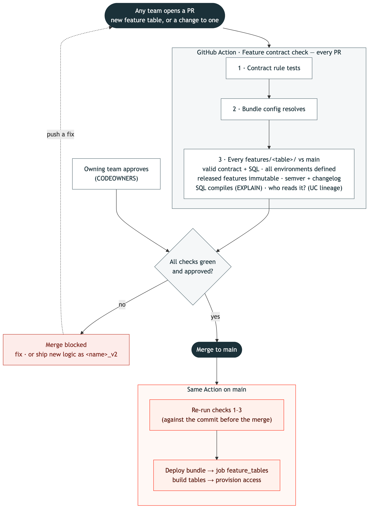
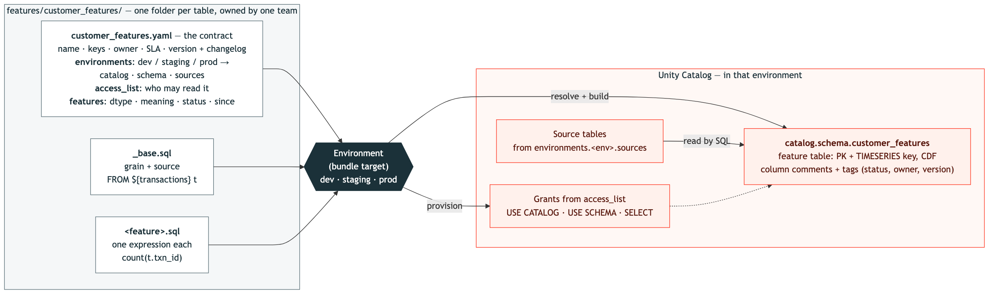
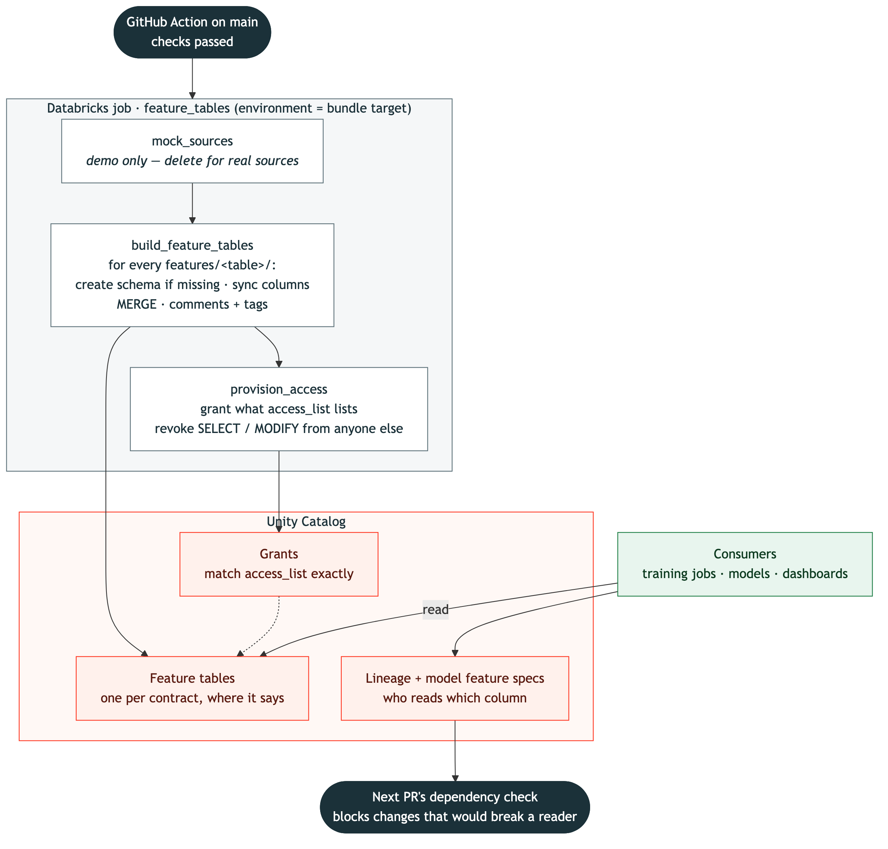

# Feature contracts repo

One repo where **every team publishes the feature tables it shares**. Each table is a
**governed Unity Catalog feature table defined as code**: its contract (schema, meaning,
lifecycle, who can read it) and its SQL. **Every PR is checked** before it can merge, whichever
team opens it, and once it merges **GitHub Actions builds the tables and provisions access**.



## The idea

A feature table is defined entirely by files in Git. Any team adds a table (a new folder) or
changes one (a PR against its folder); the contract check runs on every PR; the change can
only merge if every check passes and the owning team approves; and once it does, the pipeline
(re)builds the tables and makes their grants match the contracts. Released features are
**immutable** — new logic ships as a new feature (`<name>_v2`), never an in-place edit — so a
change can never silently alter what a model or job already reads.

This folder is self-contained — its own bundle (`databricks.yml`), jobs (`resources/`) and
CI/CD (`.github/`) — so it can be the root of its own repo.

## Layout

```
feature_contracts_repo/
  databricks.yml                 the bundle (catalog/schema variables, dev/staging/prod)
  resources/feature-tables.yml   the jobs (below)
  .github/                       CI/CD (contract-check.yml), CODEOWNERS, PR + issue templates
  features/<table>/              one self-contained folder per feature table, owned by one team
    customer_features.yaml       the contract: where it lives per environment, schema, meaning, owner, access_list, lifecycle, semver, changelog
    _base.sql                    the query skeleton (grain + source), with a ${features} placeholder
    <feature>.sql                one SQL aggregate expression per feature (e.g. txn_count.sql)
  producer.py                    builds EVERY features/<table>/ into a UC feature table
  demo/mock_sources.py           DEMO ONLY: writes the mock source data (delete in a real repo)
  provision_access.py            makes each table's UC grants match its access_list
  consumer.py                    reads a feature table and prints its Unity Catalog lineage
  shared/feature_contract_utils.py   the contract rules as plain, unit-tested functions
  governance/
    check_all.py                 the PR gate for the whole repo: every features/<table>/
    check_change.py              the gate for one table (immutability, semver, SQL compile, downstream impact)
    dependencies.py              what reads a table/column, from Unity Catalog lineage
    notebooks/find_feature_consumers.py   the same lookup, runnable as a job
  tests/                         unit tests for the contract rules and the gate
  requirements-ci.txt            pinned deps for the checks
  diagrams/                      PR lifecycle, contract anatomy, after-merge flow (.mmd + rendered .png/.svg)
```

**Add a feature table** by opening a PR with a new folder under `features/` (contract + SQL)
and a line for your team in `.github/CODEOWNERS`. The jobs build every folder; nothing else
needs to change.

## A feature table, as code



`features/customer_features/customer_features.yaml` is the **contract** — what the table
promises (keys, owner, SLA, who can read it, and each feature's type, meaning, status and
`since` version). Each feature's **logic** is the SQL file beside it: `_base.sql` is the query
skeleton (one row per customer over the source `transactions`), and each `<feature>.sql` is a
single aggregate expression inserted at `${features}`, for example:

```sql
-- txn_count.sql
count(t.txn_id)
```

`producer.py` loads the contract for the environment it runs in (see below), inserts every
expression into `_base.sql`, and writes the table with a
`PRIMARY KEY (customer_id, as_of_date TIMESERIES)` and Change Data Feed — which is what makes
it a feature table consumers can point-in-time join. It also sets discovery comments and tags.

## Where a table lives (`environments:`)

Each contract decides, per environment, which catalog and schema its table goes in and which
source tables it reads. The bundle only says which environment this is (its target: `dev`,
`staging` or `prod`), so different teams can publish to different catalogs and schemas.

```yaml
name: customer_features            # the table is <catalog>.<schema>.<name>
environments:
  dev:
    catalog: workspace
    schema: team_a_features_dev
    sources:
      transactions: workspace.feature_demo_raw_dev.transactions
  staging: {...}
  prod:
    catalog: prod_features
    schema: team_a
    sources:
      transactions: prod_raw.payments.transactions
```

The SQL refers to a source by its name — `FROM ${transactions} t` — and gets that
environment's table. Rules (checked on every PR):
- all three environments are defined, each with `catalog`, `schema` and `sources`
  (`name: catalog.schema.table`), using the same source names everywhere;
- any `${...}` in the SQL that isn't a source name blocks the PR (`${features}` is reserved);
- moving a table (any environment's catalog or schema, or its `name`) is never allowed in
  place — publish a new table; repointing a source is a patch;
- no two contracts may claim the same table in any environment.

The producer creates the schema if it's missing but never a catalog.

## Who can read it (`access_list`)

```yaml
access_list:
  - team_b_data_science                                     # a bare name gets SELECT
  - {principal: team_a_engineers, privileges: [SELECT, MODIFY]}
```

The `provision_access` task makes Unity Catalog match this list **exactly**: listed principals
get their privileges on the table (plus `USE CATALOG` / `USE SCHEMA` to reach it), and SELECT /
MODIFY is **revoked** from anyone not listed — except the table owner and the job's identity.
Principals must exist as account groups or users. A contract without `access_list` leaves its
grants alone. The checked-in demo grants `account users` so it runs without setup. The table
gets a `readers` tag listing who has access, visible in Catalog Explorer.

## The checks (what gates a merge)

On **every PR**, `.github/workflows/contract-check.yml` runs `governance/check_all.py`, which
compares every `features/<table>/` with `main`:

- **A changed table** goes through `check_change.py`:
  1. **Valid?** contract (including `access_list`) and SQL parse, one SQL file per feature.
  2. **What changed?** added / deprecated / changed / removed / metadata / access revoked.
  3. **Allowed?** released features are immutable (no in-place SQL or type change); an active
     feature can't be removed; the semver bump and changelog entry must match the change.
  4. **Compiles?** the full feature query passes `EXPLAIN`.
  5. **Who depends on it?** for anything that would affect existing readers, `dependencies.py`
     reads Unity Catalog lineage (models, jobs, pipelines, dashboards). A change that would
     break a reader is **blocked**; if a dependency can't be read, the PR is blocked too.
- **A new table** must have a valid contract with a changelog entry, SQL that compiles, and a
  table name that isn't already taken in Unity Catalog.
- **A deleted table folder** is blocked — deprecate and remove its features instead.
- **Two contracts declaring the same table** are blocked.

Any failing step **stops the run and fails the check**, so nothing is created from an unsafe
change. Merge is allowed only when the check passes and the table's code owners approve
(make *Check, then create features* a required status check and turn on *Require review from
Code Owners* on `main`).

## Who creates the features and grants access



**GitHub Actions does.** After a PR merges to `main` (or on a manual run of the workflow),
the same workflow — having passed the checks — runs:

```
deploy the bundle  →  run feature_tables (build the tables, then provision access)  →  run feature_consumer
```

On a pull request the workflow runs the checks only (the gate).

## Jobs (Databricks bundle)

Defined in `resources/feature-tables.yml`:

| Job | What it does |
|---|---|
| `feature_tables` | `mock_sources` writes the demo's source data (delete in a real repo); `build_feature_tables` builds every `features/<table>/` as a UC feature table where its contract says it lives in this environment; then `provision_access` makes each table's grants match its `access_list` |
| `feature_consumer` | Reads a feature table and shows its lineage |
| `feature_consumers_check` | Reports what depends on a table/column (the same lookup as the PR gate; `fail_if_active=true` makes it the removal gate) |

## Run it locally

```bash
cd feature_contracts_repo
pip install -r requirements-ci.txt
pytest tests -q                                   # the contract-rule unit tests

export DATABRICKS_CONFIG_PROFILE=dbc-aef35066-afa2
databricks bundle deploy -t dev
databricks bundle run feature_tables -t dev       # build the tables + provision access
databricks bundle run feature_consumer -t dev     # read + show lineage
```

Check a PR locally the way CI does (compare every table against `main`):

```bash
cd feature_contracts_repo
git worktree add /tmp/base origin/main
python governance/check_all.py --base-root /tmp/base/feature_contracts_repo --env dev
```

(Once this folder is its own repo, use `--base-root /tmp/base`.)

## Making a change

| Change | How | Version |
|---|---|---|
| New feature table | a new `features/<table>/` folder + your team in CODEOWNERS | its first version |
| New feature | add a `<name>.sql` + a `features:` entry (with `since`) | minor |
| New logic for an existing feature | add `<name>_v2`; deprecate `<name>` (`status`, `sunset_date`, `replaced_by`) | minor |
| Remove a deprecated feature | delete it once nothing reads it | major |
| Point a source at another table | change `environments.<env>.sources` | patch |
| Move a table (catalog, schema or name) | **not allowed** — publish a new table | — |
| Grant a team access | add it to `access_list` | patch |
| Revoke a team's access | remove it from `access_list` (the check warns: make sure they've moved off) | minor |
| Definition text, owner, SLA | metadata only | patch |
| Change a released feature's SQL or type in place | **not allowed** — ship `<name>_v2` | — |

Every change needs a changelog entry; SQL comments and whitespace don't count as changes.

## Moving to its own repo

Copy this folder's contents to the root of the new repo, add the `DATABRICKS_HOST` /
`DATABRICKS_TOKEN` secrets, and set the branch protection above. Then, in the platform repo,
delete `feature_contracts_repo/`, `.github/workflows/feature_contracts_repo-contract-check.yml`
(the temporary copy of the workflow) and the feature-contract lines in its CODEOWNERS and
templates.
